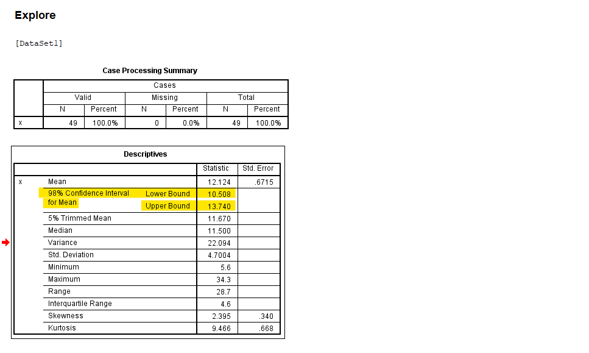
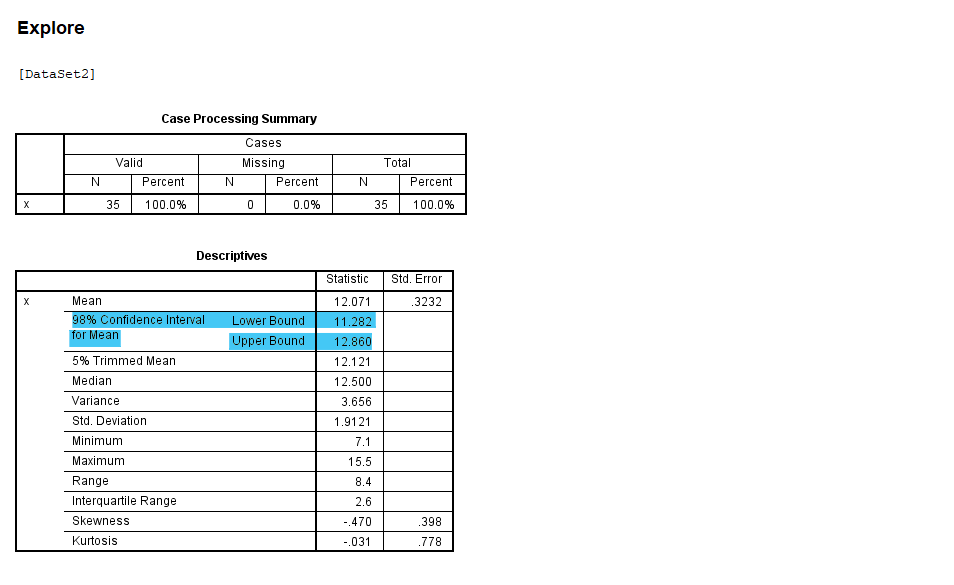
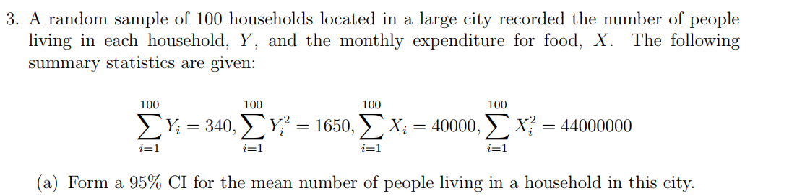
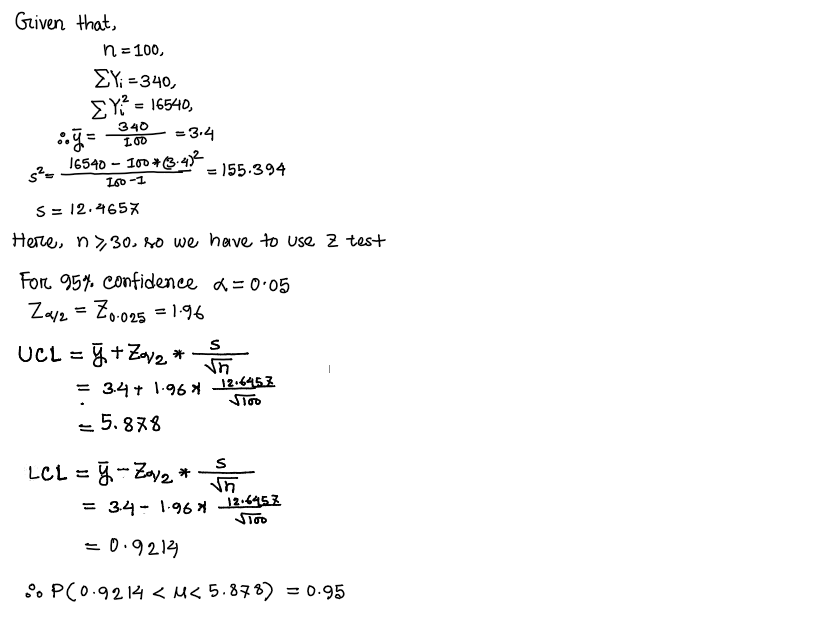
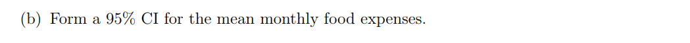
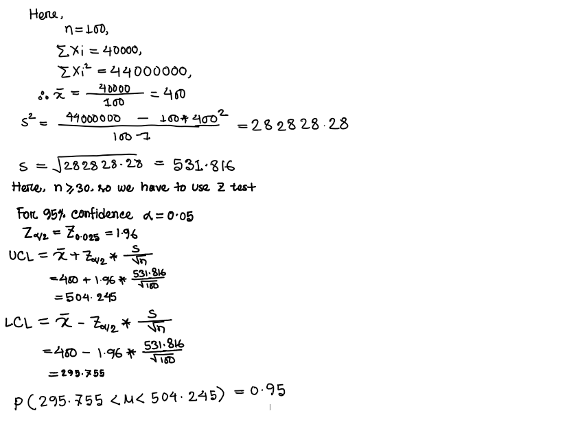
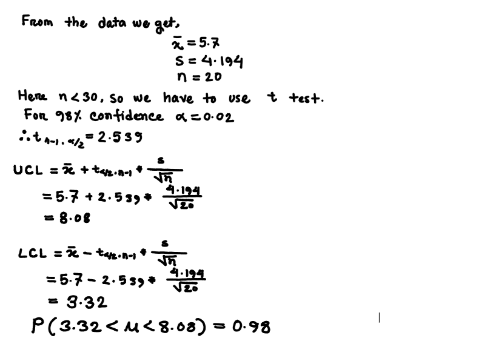
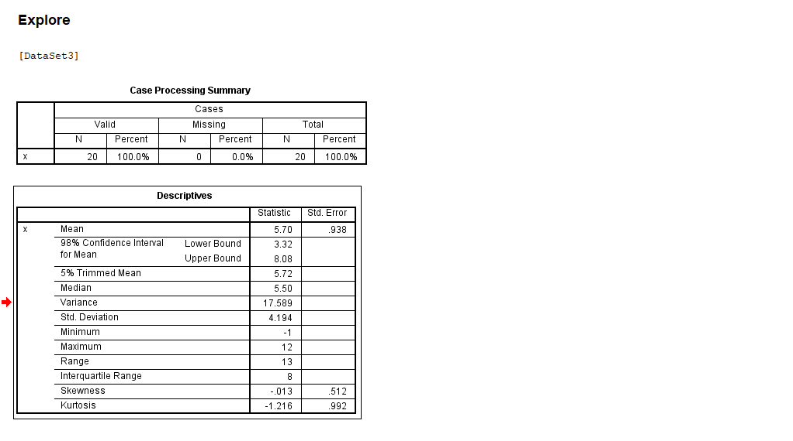

**(1) Many mutual funds use an investment approach involving owning stocks whose price/earnings multiples (P/Es) are less than the P/E of the S&P 500. The following data give P/Es of 49 companies that a randomly selected mutual fund owns in a particular year.**

6.8, 5.6, 8.5, 8.5, 8.4, 7.5, 9.3, 9.4, 7.8, 7.1, 9.9, 9.6, 9.0, 9.4, 13.7, 16.6, 9.1, 10.1, 10.6, 11.1,
8.9 11.7 12.8, 11.5, 12.0, 10.6, 11.1, 6.4, 12.3, 12.3, 11.4, 9.9, 14.3 11.5, 11.8, 13.3, 12.8,
13.7, 13.9, 12.9, 14.2, 14.0, 15.5, 16.9, 18.0, 17.9, 21.8, 18.4, 34.3

#### (a) Find a 98% CI for the mean P/E multiples.


#### i. Use direct formula

#### From the data we get 
                Sample mean x̄ = 12.13, 
                sample size n = 49,
                sample standard devaition s = 4.7,
                For 98% confidence interval α= 0.02
 Here n > 30 ,so we have to use z test
 
 Now
 z<sub>α/2</sub> = z<sub> 0.01 </sub> = 2.33

Therefore,

Lower confidence Interval = x̄ - z<sub>α/2</sub> $\frac{s}{\sqrt{n}}$

   = 12.13 - 2.33 $\frac{4.7}{\sqrt{49}}$
   
   =10.56


Upper confidence Interval = x̄ + z<sub>α/2</sub> $\frac{s}{\sqrt{n}}$

   = 12.13 + 2.33 $\frac{4.7}{\sqrt{49}}$
   
   =13.69

Confidence Interval  **P(10.56 < μ <13.69) = .98**

#### ii. Use SPSS


```R
#Import the data from excel
```

GET DATA /TYPE=XLSX

  /FILE='C:\Users\Mizan\Data.xlsx'
  
  /SHEET=name 'Data'
  
  /CELLRANGE=full
  
  /READNAMES=on
  
  /ASSUMEDSTRWIDTH=32767.`


```R
# See the Descriptives statistics including confidence interval for 98% cofidence 
```


EXECUTE.

DATASET NAME DataSet1 WINDOW=FRONT.

EXAMINE VARIABLES=x

  /PLOT NONE
  
  /STATISTICS DESCRIPTIVES
  
  /CINTERVAL 98
  
  /MISSING LISTWISE
  
  /NOTOTAL.`




Confidence Interval  **P(10.508 < μ <13.740) = .98**

#### iii. Use R


```R
data <- c(
  6.8,5.6,8.5,8.5,8.4,7.5,9.3,9.4,7.8,7.1,9.9,
  9.6,9.0,9.4,13.7,16.6,9.1,10.1,10.6,11.1,8.9,
  11.7,12.8,11.5,12.0,10.6,11.1,6.4,12.3,12.3,
  11.4,9.9,14.3,11.5,11.8,13.3,12.8,13.7,13.9,
  12.9,14.2,14.0,15.5,16.9,18.0,17.9,21.8,18.4,34.3
)

m <- mean(data)
s<- sd(data)
n <- length(data)
z <- abs(qnorm(.01))

LCI <- m-z*s/sqrt(n)
UCI <- m+z*s/sqrt(n)

print(LCI)
print(UCI)

```

    [1] 10.56237
    [1] 13.68661
    

Confidence Interval  **P(10.56237 < μ <13.68661) = .98**

#### Using t test


```R
LCI <- t.test(data,conf.level = 0.98) $ conf.int[1]
UCI <- t.test(data,conf.level = 0.98) $ conf.int[2]
print(LCI)
print(UCI)
```

    [1] 10.5085
    [1] 13.74048
    

Confidence Interval  **P(10.508 < μ <13.740) = .98**

#### (b) Interpret the result and state any assumptions you have made


```R

```

**(2) In a pharmacological experiment, 35 lab rats were not given water for 11 hours and were
then permitted access to water for 1 hour. The amounts of water consumed (mL/h) are
given in the following:**


10.6, 13.3, 15.5, 10.7, 9.6, 12.1, 11.8, 10.9, 9.9, 13.2, 9.3, 11.7, 9.9, 13.0, 12.3, 11.0, 13.1,
11.0, 12.5, 13.9, 14.1, 14.8, 15.1, 12.8, 14.0, 7.1, 14.1, 12.7, 9.6, 12.5, 9.0, 12.7, 13.6, 12.5,
12.6

(a) Obtain a 98% CI for the mean amount of water consumed. (Use SPSS)


```R
#Import the data from excel
```

GET DATA /TYPE=XLSX

  /FILE='C:\Users\Mizan\Data2.xlsx'
  
  /SHEET=name 'Data2'
  
  /CELLRANGE=full
  
  /READNAMES=on
  
  /ASSUMEDSTRWIDTH=32767.


```R
# See the Descriptives statistics including confidence interval for 98% cofidence 
```

EXECUTE.

DATASET NAME DataSet2 WINDOW=FRONT.

EXAMINE VARIABLES=x

  /PLOT NONE
  
  /STATISTICS DESCRIPTIVES
  
  /CINTERVAL 98
  
  /MISSING LISTWISE
  
  /NOTOTAL.



Confidence Interval  **P(11.282 < μ < 12.860 ) = .98**

(b) Obtain a 98% CI for the mean amount of water consumed. [Use R]


```R
data2 <- c(10.6,13.3,15.5,10.7,9.6,12.1,11.8,10.9,9.9,13.2,9.3,11.7
           ,9.9,13.0,12.3,11.0,13.1,11.0,12.5,13.9,14.1,14.8,15.1,12.8,14.0,
           7.1,14.1,12.7,9.6,12.5,9.0,12.7,13.6,12.5,12.6)
m <- mean(data2)
s<- sd(data2)
n <- length(data2)
z <- abs(qnorm(.01))

LCI <- m-z*s/sqrt(n)
UCI <- m+z*s/sqrt(n)
print(LCI)
print(UCI)
```

    [1] 11.31953
    [1] 12.82332
    

Confidence Interval  **P(11.31953 < μ < 82.82332 ) = .98**

#### Using t test 


```R
LCI <- t.test(data2,conf.level = 0.98) $ conf.int[1]
UCI <- t.test(data2,conf.level = 0.98) $ conf.int[2]
print(LCI)
print(UCI)
```

    [1] 11.28243
    [1] 12.86043
    

Confidence Interval  **P(11.282 < μ < 12.860 ) = .98**









**(4) A medication is suspected of causing an elevated heart rate in a certain group of high-risk
patients. Twenty patients from the group were given the medication. The changes in heart
rates were found to be as follows:**

-1, 8, 5, 10, 2, 12, 7, 9, 1, 3, 4, 6, 4, 12, 11, 2, -1, 10, 2, 8

(a) Assume that the population has a normal distribution. Construct a 98% CI for the
mean change in heart rate.

**i. Use direct formula**



**ii. Use SPSS**


```R
#Import the data from excel
```

DATASET ACTIVATE DataSet1.

GET DATA /TYPE=XLSX

  /FILE='C:\Users\Mizan\Data3.xlsx'
  
  /SHEET=name 'Data3'
  
  /CELLRANGE=full
  
  /READNAMES=on
  
  /ASSUMEDSTRWIDTH=32767.


```R
# See the Descriptives statistics including confidence interval for 98% cofidence 
```

EXECUTE.

DATASET NAME DataSet3 WINDOW=FRONT.

EXAMINE VARIABLES=x

  /PLOT NONE
  
  /STATISTICS DESCRIPTIVES
  
  /CINTERVAL 98
  
  /MISSING LISTWISE
  
  /NOTOTAL.




**ii. Use R**


```R
data3 <- c(-1, 8, 5, 10, 2, 12, 7, 9, 1, 3, 4, 6, 4, 12, 11, 2, -1, 10, 2, 8)

LCI <- t.test(data3,conf.level = 0.98) $ conf.int[1]
UCI <- t.test(data3,conf.level = 0.98) $ conf.int[2]
print(LCI)
print(UCI)
```

    [1] 3.318466
    [1] 8.081534
    

Confidence Interval  **P(3.318466 < μ < 8.081534 ) = .98**

**(5)The following data represent the rates (micrometers per hour) at which a razor cut made in
the skin of anesthetized newts is closed by new cells: [Use R]**

28, 20, 21, 39, 32, 23, 18, 31, 14, 23, 18, 22, 28, 24, 33, 12, 23, 21, 25, 25

(a) Can we say that the data are approximately normally distributed?


```R
data4 <- c(28, 20, 21, 39, 32, 23, 18, 31, 14, 23, 18, 22, 28, 24, 33, 12, 23, 21, 25, 25)
shapiro.test(data4)
```


    
    	Shapiro-Wilk normality test
    
    data:  data4
    W = 0.97674, p-value = 0.8854
    


Here p value > 0.05 ,so we do not reject the null hypothesis.

So we may say that the data are approximately **normally distributed**

#### (b) Find a 95% CI for population mean rate µ for the new cells to close a razor cut made in the skin of anesthetized newts.


```R
LCI <- t.test(data4,conf.level = 0.95) $ conf.int[1]
UCI <- t.test(data4,conf.level = 0.95) $ conf.int[2]
print(LCI)
print(UCI)
```

    [1] 20.9442
    [1] 27.0558
    

Confidence Interval  **P( 20.9442< μ < 27.0558 ) = .95**

#### (c) Find a 99% CI for population mean rate µ.


```R
LCI <- t.test(data4,conf.level = 0.99) $ conf.int[1]
UCI <- t.test(data4,conf.level = 0.99) $ conf.int[2]
print(LCI)
print(UCI)
```

    [1] 19.82306
    [1] 28.17694
    

Confidence Interval  **P(19.82306 < μ < 28.17694 ) = .99**

#### (d) Is the 95% CI wider or narrower than the 99% CI? Briefly explain why

**95% CI narrower than the 99% CI**

**(6) A random sample from a normal population yields the following 25 values:**

90, 87, 121, 96, 106, 107, 89, 107, 83, 92, 117, 93, 98, 120, 97, 109, 78, 87, 99, 79, 104, 85,
91, 107, 89

(a) Calculate an unbiased estimate σ^2 of the population variance.


```R

```

(b) Give approximate 99% CI for the population variance and standard deviation.


```R
data5 <- c(90,87,121,96,106,107,89,107,83,92,117,93,98,120,97,109,78,87,99,79,104,85,91,107,89)
alpha <- 0.01

n <- length(data5)
v <- var(data5)
chi0.005 <- qchisq(alpha/2, df=n-1)
chi0.005
chi0.995 <- qchisq((1-alpha/2), df=n-1)
chi0.995
LCI <- (v*(n-1))/chi0.005
UCI <- (v*(n-1))/chi0.995
print(LCI)
print(UCI)
```


9.88623350224147


45.5585119365306


    [1] 360.3556
    [1] 78.19746
    

**P(78.19746 < σ^2 < 360.3556)= 0.99**

(d) Test the normality assumption


```R
shapiro.test(data5)
```


    
    	Shapiro-Wilk normality test
    
    data:  data5
    W = 0.95577, p-value = 0.3366
    


Here p value > 0.05 ,so we do not reject the null hypothesis.

So we may say that the data are approximately **normally distributed**

**(7) A survey conducted by Sallie Mae and Gallup of 1404 respondents found that 323 students
paid for their education by student loans. Find the 90% confidence interval of the true
proportion of students who paid for their education by student loans.**


```R
#Here 
alpha = 0.10
n= 1404
x = 323
p_hat <- x/n
LCI = (p_hat + sqrt((p_hat*(1-p_hat)/n)))*100
UCI = (p_hat - sqrt((p_hat*(1-p_hat)/n)))*100
print(LCI)
print(UCI)
```

    [1] 24.12891
    [1] 21.88248
    
